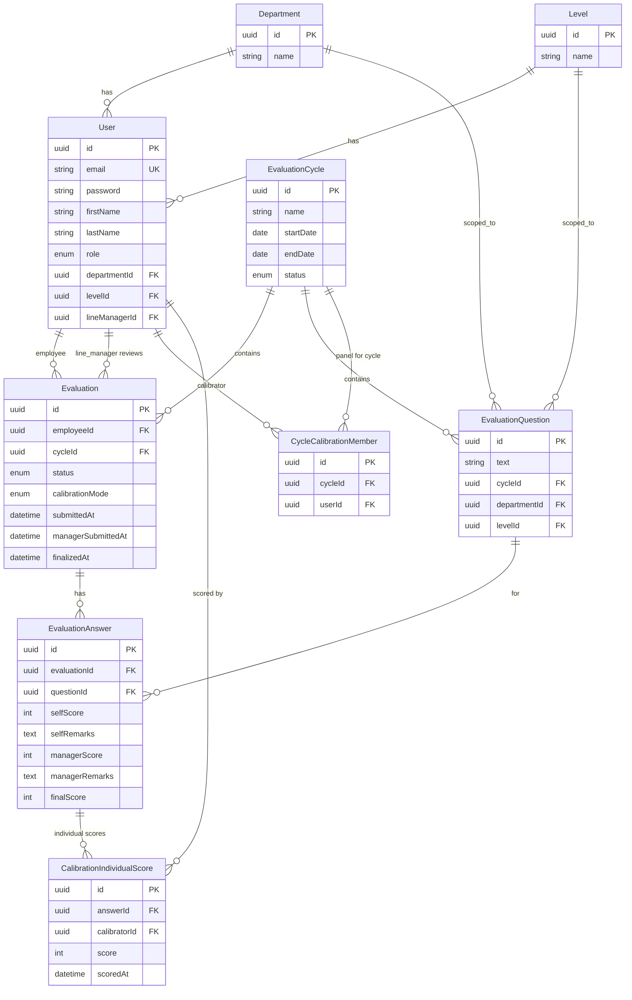
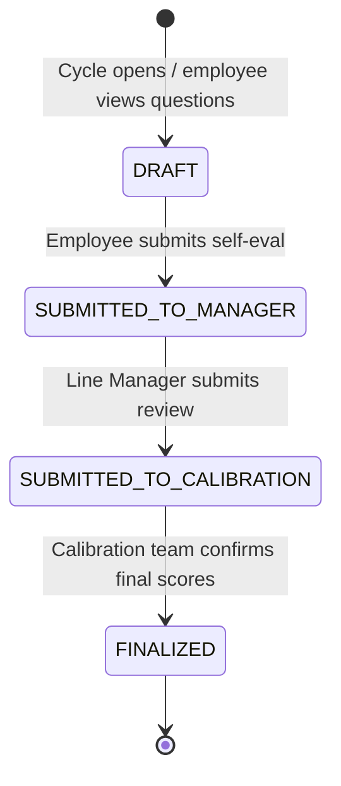
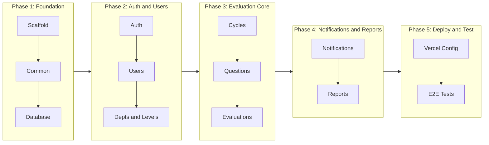

# Backend API Build Plan

## Tech Stack (LTS/Stable — versions confirmed via WebSearch before install)

- **Runtime**: Node.js 22.x LTS
- **Framework**: NestJS (latest stable)
- **Language**: TypeScript 5.x strict mode
- **ORM**: Prisma (latest stable) with Supabase PostgreSQL
- **Auth**: `@nestjs/jwt` + `@nestjs/passport` + `bcrypt`
- **Validation**: `class-validator` + `class-transformer`
- **Docs**: `@nestjs/swagger` (OpenAPI 3.0)
- **Email**: Resend SDK
- **Export**: `exceljs` (Excel), `pdfkit` or `@react-pdf/renderer` (PDF)
- **Deployment**: Vercel Serverless Functions
- **Testing**: Jest (unit + e2e)

## Database Schema (Prisma)

**Key enums:**

- `UserRole`: `ADMIN`, `EMPLOYEE`, `LINE_MANAGER`, `CALIBRATION`
- `CycleStatus`: `OPEN`, `CLOSED`
- `EvaluationStatus`: `DRAFT`, `SUBMITTED_TO_MANAGER`, `SUBMITTED_TO_CALIBRATION`, `FINALIZED`
- `CalibrationMode`: `INDIVIDUAL_AGGREGATE`, `DIRECT_TEAM` (set per evaluation at calibration time)

**New models (calibration team enhancement):**

- **CycleCalibrationMember** — join table linking calibration users to a specific cycle. Admin assigns these when creating/editing a cycle. Unique constraint on (cycleId, userId).
- **CalibrationIndividualScore** — stores each calibration member's individual score per answer. Unique constraint on (answerId, calibratorId).
- **Evaluation.calibrationMode** — indicates whether the final score was derived from individual aggregation or direct team entry. Set when calibration begins scoring.

**Calibration scoring logic:**

- When mode is `INDIVIDUAL_AGGREGATE`: each assigned calibrator enters their score per question via `CalibrationIndividualScore`. The system computes `finalScore = ROUND(AVG(individual scores))` and writes it to `EvaluationAnswer.finalScore` on finalization.
- When mode is `DIRECT_TEAM`: calibration team enters `finalScore` directly on `EvaluationAnswer` (original flow). No individual scores recorded.
- The mode can be set per evaluation — some employees may be calibrated individually, others by team consensus.

## Evaluation Workflow (state machine)

At each transition:

- Previous stage inputs are **locked** (enforced at service layer)
- Email notification is sent to the next actor
- Audit timestamps are recorded

## Module Build Order

The modules are built in dependency order — each one builds on the previous:

### Phase 1 — Foundation

**1. Project Scaffold & Config** — [backend/](backend/)

- Scaffold NestJS project with strict TypeScript
- Configure Prisma with Supabase PostgreSQL connection
- Set up `@nestjs/config` with Joi validation for env vars
- Configure Vercel serverless adapter (`api/index.ts` entry point)
- Set up global pipes (`ValidationPipe`), filters (exception filter), and interceptors (response transform)
- Set up Swagger at `/api/docs`

**2. Common Module** — [backend/src/common/](backend/src/common/)

- `ApiResponse<T>` and `PaginatedResult<T>` response wrapper types
- Global `HttpExceptionFilter` — consistent error envelope
- `TransformInterceptor` — wraps all responses in `{ success, data, message, meta }`
- `@CurrentUser()` parameter decorator
- `@Roles()` decorator + `RolesGuard`
- Pagination utility (`buildPaginationMeta`)

**3. Database & Prisma Schema** — [backend/prisma/schema.prisma](backend/prisma/schema.prisma)

- All 9 models (Department, Level, User, EvaluationCycle, CycleCalibrationMember, EvaluationQuestion, Evaluation, EvaluationAnswer, CalibrationIndividualScore)
- Enums for UserRole, CycleStatus, EvaluationStatus, CalibrationMode
- Relations, indexes, and constraints
- `PrismaService` extending `PrismaClient` with `onModuleInit` / `onModuleDestroy`
- Seed script for initial admin user + sample departments/levels

### Phase 2 — Auth & User Management

**4. Auth Module** — [backend/src/modules/auth/](backend/src/modules/auth/)

- `POST /api/v1/auth/login` — validate credentials, return JWT access + refresh tokens
- `POST /api/v1/auth/refresh` — rotate refresh token
- `PATCH /api/v1/auth/password` — change own password
- `JwtStrategy` (passport) — validates token, attaches user to request
- `JwtAuthGuard` — protects all authenticated routes
- Password hashing with bcrypt (12 rounds)

**5. Users Module** — [backend/src/modules/users/](backend/src/modules/users/)

- `POST /api/v1/users` — admin creates user (any role)
- `GET /api/v1/users` — admin lists users (filterable by role, department, level)
- `GET /api/v1/users/:id` — get user detail
- `PATCH /api/v1/users/:id` — admin updates user (or user updates own profile: name, password)
- `DELETE /api/v1/users/:id` — admin soft-deletes user
- `POST /api/v1/users/:id/assign` — admin assigns employee to department, level, line manager

**6. Departments & Levels Module** — [backend/src/modules/departments/](backend/src/modules/departments/) and [backend/src/modules/levels/](backend/src/modules/levels/)

- Full CRUD for departments and levels (admin only)
- `GET /api/v1/departments`, `POST`, `PATCH`, `DELETE`
- `GET /api/v1/levels`, `POST`, `PATCH`, `DELETE`

### Phase 3 — Evaluation Core

**7. Evaluation Cycles Module** — [backend/src/modules/evaluation-cycles/](backend/src/modules/evaluation-cycles/)

- `POST /api/v1/evaluation-cycles` — admin creates cycle (includes calibration member user IDs)
- `GET /api/v1/evaluation-cycles` — list cycles (with status filter, includes calibration panel)
- `GET /api/v1/evaluation-cycles/:id` — cycle detail with assigned calibration members
- `PATCH /api/v1/evaluation-cycles/:id` — admin updates cycle (can add/remove calibration members)
- `POST /api/v1/evaluation-cycles/:id/close` — admin closes cycle

**8. Evaluation Questions Module** — [backend/src/modules/evaluation-questions/](backend/src/modules/evaluation-questions/)

- `POST /api/v1/evaluation-questions` — admin creates question (assigned to cycle + department + level)
- `GET /api/v1/evaluation-questions` — list questions (filterable by cycle, department, level)
- `PATCH /api/v1/evaluation-questions/:id` — admin updates question
- `DELETE /api/v1/evaluation-questions/:id` — admin deletes question

**9. Evaluations Module** — [backend/src/modules/evaluations/](backend/src/modules/evaluations/)
This is the core workflow module handling all three stages:

*Employee endpoints:*

- `GET /api/v1/evaluations/my` — employee views their evaluation for active cycle
- `PATCH /api/v1/evaluations/:id/self` — employee saves self scores/remarks (draft)
- `POST /api/v1/evaluations/:id/submit-self` — employee submits (locks, status -> SUBMITTED_TO_MANAGER)

*Line Manager endpoints:*

- `GET /api/v1/evaluations/pending-review` — list pending evaluations for manager's department
- `GET /api/v1/evaluations/:id/review` — view employee self-eval + enter manager scores
- `PATCH /api/v1/evaluations/:id/manager` — save manager scores/remarks
- `POST /api/v1/evaluations/:id/submit-manager` — submit (locks, status -> SUBMITTED_TO_CALIBRATION)

*Calibration endpoints:*

- `GET /api/v1/evaluations/pending-calibration` — list evaluations awaiting calibration (only for members assigned to this cycle)
- `GET /api/v1/evaluations/:id/calibrate` — view all scores (self + manager + individual calibrator scores if any)
- `PATCH /api/v1/evaluations/:id/calibration-mode` — set calibration mode (INDIVIDUAL_AGGREGATE or DIRECT_TEAM)
- `PATCH /api/v1/evaluations/:id/calibration` — save direct team final scores (DIRECT_TEAM mode)
- `PATCH /api/v1/evaluations/:id/calibration-individual` — save current calibrator's individual scores per question (INDIVIDUAL_AGGREGATE mode)
- `GET /api/v1/evaluations/:id/calibration-scores` — view all individual calibrator scores + computed aggregate (INDIVIDUAL_AGGREGATE mode)
- `POST /api/v1/evaluations/:id/finalize` — finalize with confirmation (computes aggregate if INDIVIDUAL_AGGREGATE, locks all, status -> FINALIZED)

*Shared:*

- `GET /api/v1/evaluations/:id` — view evaluation detail (role-scoped data visibility)

### Phase 4 — Notifications & Reporting

**10. Notifications Module** — [backend/src/modules/notifications/](backend/src/modules/notifications/)

- Resend SDK integration via `NotificationService`
- Email templates: self-eval submitted, manager review submitted, evaluation finalized
- Triggered from evaluation service on state transitions (not from controllers)
- Predefined templates with dynamic data (employee name, department, links)

**11. Reports Module** — [backend/src/modules/reports/](backend/src/modules/reports/)

- `GET /api/v1/reports/dashboard` — role-based summary stats (pending, completed, totals)
- `GET /api/v1/reports/export/excel` — download evaluation report as .xlsx
- `GET /api/v1/reports/export/pdf` — download evaluation report as .pdf
- Reports include: employee details, self/manager/final scores, remarks, status

### Phase 5 — Deployment & Testing

**12. Vercel Deployment**

- `vercel.json` configuration
- `api/index.ts` serverless entry point bootstrapping NestJS
- Environment variables configured in Vercel dashboard
- Swagger UI disabled in production via env flag

**13. Testing**

- Unit tests for each service (mocked Prisma)
- Guard/strategy tests for auth
- E2E tests for critical flows: login -> self-eval submit -> manager review -> calibration finalize
- Run all tests before each phase is considered complete

## API Summary

- **Auth**: 3 endpoints (login, refresh, change password)
- **Users**: 6 endpoints (CRUD + assign)
- **Departments**: 4 endpoints (CRUD)
- **Levels**: 4 endpoints (CRUD)
- **Evaluation Cycles**: 5 endpoints (CRUD + detail + close, with calibration member assignment)
- **Evaluation Questions**: 4 endpoints (CRUD)
- **Evaluations**: 14 endpoints (self-eval, manager review, calibration with dual-mode scoring, detail)
- **Notifications**: 0 public endpoints (triggered internally)
- **Reports**: 3 endpoints (dashboard, export Excel, export PDF)

**Total: ~43 endpoints across 8 public modules**

## Build Sequence Summary

