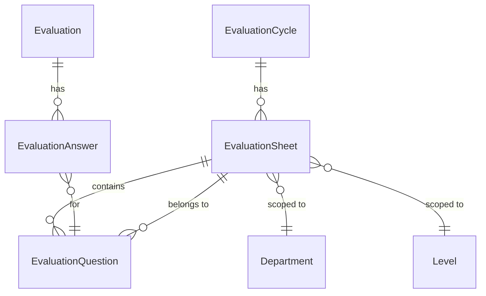

# Evaluation Schema Redesign: Sheets, Weighted Scoring, Flexible Scales

## Current Problem

Questions are flat (scoped to cycle + department + level) with no grouping layer. The Excel template shows employees get **multiple sheets** (GENERAL, SUCCESS FACTORS, PAYROLL) where each sheet has its own weight, objectives (categories), KPIs (questions), and scoring scale. The current DTOs also hardcode `@Min(1) @Max(5)` on all score fields.

## New Data Model




### New model: `EvaluationSheet`

Sits between `EvaluationCycle` and `EvaluationQuestion`. Represents one "tab" of the evaluation form.

```prisma
model EvaluationSheet {
  id        String   @id @default(uuid()) @db.Uuid
  name      String                          // e.g. "GENERAL", "SUCCESS FACTORS"
  weight    Int      @default(100)          // sheet's weight in overall evaluation
  minScore  Int      @default(1)            // minimum allowed score
  maxScore  Int      @default(10)           // maximum allowed score
  sortOrder Int      @default(0)
  createdAt DateTime @default(now())
  updatedAt DateTime @updatedAt

  cycleId      String @db.Uuid
  departmentId String @db.Uuid
  levelId      String @db.Uuid

  cycle      EvaluationCycle    @relation(...)
  department Department         @relation(...)
  level      Level              @relation(...)
  questions  EvaluationQuestion[]

  @@index([cycleId, departmentId, levelId])
  @@map("evaluation_sheets")
}
```

Key points:

- `minScore` / `maxScore` define the valid score range for this sheet (1-10, 1-5, 1-N)
- `weight` defines the sheet's contribution to the overall evaluation total (e.g., GENERAL=100, SUCCESS FACTORS=70, PAYROLL=30)
- Scoped to cycle + department + level (same as questions were before)

### Changes to `EvaluationQuestion`

- **Remove** `departmentId`, `levelId`, `cycleId` direct relations (they're inherited from the sheet)
- **Add** `sheetId` FK to `EvaluationSheet`
- **Keep** `category` (objective grouping within a sheet, e.g., "TEAMWORK"), `weight`, `sortOrder`

```prisma
model EvaluationQuestion {
  id        String  @id @default(uuid()) @db.Uuid
  text      String
  category  String?                         // objective grouping within the sheet
  weight    Int     @default(10)            // question weight within the sheet
  sortOrder Int     @default(0)
  ...
  sheetId   String  @db.Uuid
  sheet     EvaluationSheet @relation(...)
  // no more cycleId, departmentId, levelId directly
}
```

### Changes to `Department` and `Level` models

Add the `sheets` relation to both.

## Score Validation Changes

### DTOs: Remove hardcoded `@Min(1) @Max(5)`

In these 4 files, change all score fields to only validate `@IsInt() @Min(1)` (floor only). The ceiling is validated at the **service layer** by looking up the sheet's `maxScore`:

- [self-evaluation.dto.ts](backend/src/modules/evaluations/dto/self-evaluation.dto.ts) -- `@Min(1) @Max(5)` on `score`
- [manager-review.dto.ts](backend/src/modules/evaluations/dto/manager-review.dto.ts) -- `@Min(1) @Max(5)` on `score`
- [calibration.dto.ts](backend/src/modules/evaluations/dto/calibration.dto.ts) -- `@Min(1) @Max(5)` on `finalScore` and `score`

### Service-layer validation

In `evaluations.service.ts`, when saving scores (self, manager, calibration), look up the answer's question's sheet to get `minScore`/`maxScore` and validate at runtime:

```typescript
private async validateScoreRange(questionId: string, score: number): Promise<void> {
  const question = await this.prisma.evaluationQuestion.findUniqueOrThrow({
    where: { id: questionId },
    include: { sheet: { select: { minScore: true, maxScore: true } } },
  });
  if (score < question.sheet.minScore || score > question.sheet.maxScore) {
    throw new BadRequestException(
      `Score ${score} out of range [${question.sheet.minScore}-${question.sheet.maxScore}]`
    );
  }
}
```

## Evaluation Creation Changes

In `getMyEvaluation()` in [evaluations.service.ts](backend/src/modules/evaluations/evaluations.service.ts), the query currently fetches questions by `cycleId + departmentId + levelId`. This changes to:

1. Find all sheets for the employee's cycle + department + level
2. Find all questions belonging to those sheets
3. Create answer rows for all of them

The `EVALUATION_INCLUDE` constant needs to include `question.sheet` so the frontend can group answers by sheet.

## Reports / Aggregation Changes

In [reports.service.ts](backend/src/modules/reports/reports.service.ts), `computeStats` currently does simple averages. It needs to compute **weighted scores**:

- Per-question weighted score = `(score / maxScore) * question.weight`
- Per-sheet weighted total = sum of question weighted scores
- Overall = weighted combination of sheet totals

The score distribution histogram (currently hardcoded to 5 buckets) needs to be dynamic based on `maxScore`.

## Evaluation Questions Module Changes

- [evaluation-questions.service.ts](backend/src/modules/evaluation-questions/evaluation-questions.service.ts) -- `create` and `bulkCreate` now take `sheetId` instead of `cycleId + departmentId + levelId`
- [create-question.dto.ts](backend/src/modules/evaluation-questions/dto/create-question.dto.ts) -- Replace `cycleId`, `departmentId`, `levelId` with `sheetId`
- [bulk-create-questions.dto.ts](backend/src/modules/evaluation-questions/dto/bulk-create-questions.dto.ts) -- Replace `cycleId` + per-item `departmentId`/`levelId` with `sheetId`
- [query-questions.dto.ts](backend/src/modules/evaluation-questions/dto/query-questions.dto.ts) -- Add `sheetId` filter, keep `cycleId`/`departmentId`/`levelId` as pass-through filters (via sheet relation)

## New Module: Evaluation Sheets

New CRUD module at `src/modules/evaluation-sheets/`:

- `evaluation-sheets.controller.ts` -- CRUD + bulk create
- `evaluation-sheets.service.ts` -- Validation, scoping
- `dto/create-sheet.dto.ts` -- name, weight, minScore, maxScore, cycleId, departmentId, levelId
- `dto/update-sheet.dto.ts`

Register in [app.module.ts](backend/src/app.module.ts).

## Shared Types Updates

- [shared/types/models.ts](shared/types/models.ts) -- Add `EvaluationSheet` interface, update `EvaluationQuestion` (replace dept/level/cycle with `sheet`), add `sheet` to `EvaluationAnswer.question`
- [shared/types/dto.ts](shared/types/dto.ts) -- Update `CreateQuestionPayload`, add `CreateSheetPayload`, update bulk payloads

## Database Migration

Via Supabase MCP `apply_migration`:

1. Create `evaluation_sheets` table
2. Migrate existing `evaluation_questions` data: create a default sheet per unique (cycleId, departmentId, levelId) combination, assign questions to it
3. Add `sheetId` FK to `evaluation_questions`, drop `cycleId`, `departmentId`, `levelId` FKs from questions
4. Insert the real template data (GENERAL/SUCCESS FACTORS/PAYROLL sheets with their KPIs)

## Seed Update

Update [prisma/seed.ts](backend/prisma/seed.ts) to create sheets and questions matching the Excel template structure.

## Files Changed Summary

- **Schema**: `prisma/schema.prisma`
- **New module**: `src/modules/evaluation-sheets/` (controller, service, DTOs, module)
- **Modified services**: `evaluations.service.ts`, `evaluation-questions.service.ts`, `reports.service.ts`
- **Modified DTOs**: `self-evaluation.dto.ts`, `manager-review.dto.ts`, `calibration.dto.ts`, `create-question.dto.ts`, `bulk-create-questions.dto.ts`, `query-questions.dto.ts`
- **Modified shared types**: `shared/types/models.ts`, `shared/types/dto.ts`
- **App module**: `app.module.ts`
- **Seed**: `prisma/seed.ts`
- **DB migration**: via Supabase MCP

