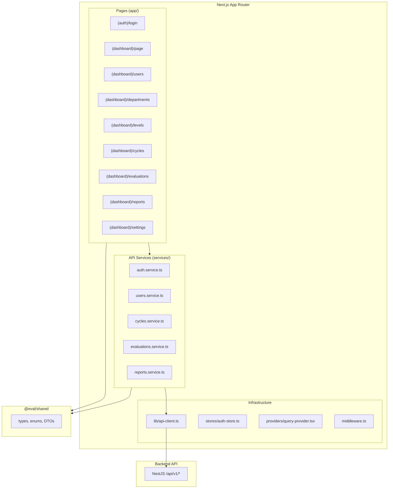

# Frontend Build Plan

## Tech Stack

- **Framework**: Next.js 15 (App Router, TypeScript strict)
- **UI Components**: shadcn/ui (Radix + Tailwind CSS)
- **Styling**: Tailwind CSS v4, CSS variables for theming (extracted from Figma dashboard)
- **Server State**: TanStack Query v5 (caching, pagination, background refetch)
- **Client State**: Zustand (auth tokens, sidebar state, active cycle selection)
- **Forms**: react-hook-form + zod (mirrors backend validation)
- **Charts**: recharts (dashboard visualizations)
- **Dark Mode**: next-themes
- **Icons**: lucide-react
- **Tables**: @tanstack/react-table (via shadcn data-table)
- **Toasts/Notifications**: sonner (via shadcn)

## Design System Strategy

1. Pull the Figma dashboard screen via Figma MCP (`get_design_context` + `get_screenshot`)
2. Extract: color palette, typography (font family, sizes, weights), border-radius, spacing scale, shadow tokens, card styles, sidebar layout
3. Map these into Tailwind CSS variables in `globals.css` and `tailwind.config.ts`
4. All shadcn/ui components will inherit these tokens automatically
5. Result: every page matches the dashboard's look and feel

## Architecture




## Directory Structure

```
frontend/
  src/
    app/
      (auth)/
        login/page.tsx
        layout.tsx
      (dashboard)/
        layout.tsx              # Sidebar + Header + role-based nav
        page.tsx                # Dashboard (from Figma)
        users/
          page.tsx              # User list + filters
          new/page.tsx          # Create user form
          [id]/page.tsx         # Edit user
          bulk/page.tsx         # Bulk import
        departments/page.tsx    # Inline CRUD table
        levels/page.tsx         # Inline CRUD table
        cycles/
          page.tsx              # Cycle list
          new/page.tsx          # Create cycle
          [id]/
            page.tsx            # Cycle detail + sheets/questions management
        evaluations/
          page.tsx              # Role-adaptive list (admin: all, manager: pending, calibration: pending)
          my/page.tsx           # Employee self-evaluation form
          [id]/
            page.tsx            # Evaluation detail (read-only, role-scoped)
            review/page.tsx     # Manager review form
            calibrate/page.tsx  # Calibration scoring + finalize
        reports/page.tsx        # Stats + export buttons
        settings/page.tsx       # Change password
    components/
      ui/                       # shadcn/ui primitives (Button, Input, Card, Dialog, etc.)
      layout/
        sidebar.tsx             # Role-based navigation sidebar
        header.tsx              # Top bar with user menu, notifications
        breadcrumbs.tsx
      domain/
        evaluation-form.tsx     # Reusable score + remarks form (self/manager/calibration)
        score-badge.tsx         # Visual score indicator
        status-badge.tsx        # Evaluation status pill
        stat-card.tsx           # Dashboard stat card
        data-table.tsx          # Generic filterable/sortable table
        user-avatar.tsx
        cycle-progress.tsx      # Visual cycle completion bar
    hooks/
      use-auth.ts               # Auth state + login/logout/refresh
      use-current-user.ts       # Current user from auth store
      use-role-guard.ts         # Client-side role check
    lib/
      api-client.ts             # Axios/fetch wrapper with JWT interceptor + refresh
      query-keys.ts             # Centralized TanStack Query key factory
      utils.ts                  # Formatters, date helpers
      validators.ts             # Zod schemas mirroring backend DTOs
    services/
      auth.service.ts
      users.service.ts
      departments.service.ts
      levels.service.ts
      cycles.service.ts
      sheets.service.ts
      questions.service.ts
      evaluations.service.ts
      reports.service.ts
    stores/
      auth-store.ts             # Zustand: tokens, user, login/logout actions
    providers/
      query-provider.tsx        # TanStack QueryClientProvider
      theme-provider.tsx        # next-themes provider
    middleware.ts               # Route protection: redirect unauthenticated to /login
```

## Screen Inventory (16 screens across 4 roles)

### Public


| Screen | Route    | Purpose                         |
| ------ | -------- | ------------------------------- |
| Login  | `/login` | Email + password form, JWT auth |


### All Authenticated


| Screen    | Route       | Purpose                                                     |
| --------- | ----------- | ----------------------------------------------------------- |
| Dashboard | `/`         | Role-adaptive stats, charts, recent activity (Figma design) |
| Settings  | `/settings` | Change password                                             |


### Admin (6 screens)


| Screen          | Route          | Purpose                                           |
| --------------- | -------------- | ------------------------------------------------- |
| Users List      | `/users`       | Filterable table (role, dept, search), pagination |
| Create User     | `/users/new`   | Form with role/dept/level/manager selection       |
| Edit User       | `/users/[id]`  | Update + assign department/level/manager          |
| Bulk Import     | `/users/bulk`  | CSV upload or paste user data                     |
| Departments     | `/departments` | Inline CRUD table (dialog for create/edit)        |
| Levels          | `/levels`      | Inline CRUD table (dialog for create/edit)        |
| Cycles List     | `/cycles`      | Cycle cards/table with status filter              |
| Cycle Detail    | `/cycles/[id]` | Manage sheets, questions, calibration panel       |
| All Evaluations | `/evaluations` | Admin-wide evaluation list with filters           |
| Reports         | `/reports`     | Stats dashboard + CSV/Excel/PDF export            |


### Employee (1 screen)


| Screen        | Route             | Purpose                                                                            |
| ------------- | ----------------- | ---------------------------------------------------------------------------------- |
| My Evaluation | `/evaluations/my` | Tabbed form (one tab per sheet), score + remarks per question, save draft + submit |


### Line Manager (2 screens)


| Screen          | Route                         | Purpose                                         |
| --------------- | ----------------------------- | ----------------------------------------------- |
| Pending Reviews | `/evaluations` (manager view) | List of team members' submitted evaluations     |
| Review Form     | `/evaluations/[id]/review`    | Side-by-side self-scores + manager score inputs |


### Calibration (2 screens)


| Screen               | Route                             | Purpose                                                             |
| -------------------- | --------------------------------- | ------------------------------------------------------------------- |
| Pending Calibrations | `/evaluations` (calibration view) | List of evaluations awaiting calibration                            |
| Calibrate            | `/evaluations/[id]/calibrate`     | Mode selection, scoring (individual/team), aggregate view, finalize |


## Sidebar Navigation (role-based)

- **ADMIN**: Dashboard, Users, Departments, Levels, Cycles, Evaluations, Reports, Settings
- **EMPLOYEE**: Dashboard, My Evaluation, Settings
- **LINE_MANAGER**: Dashboard, Evaluations (pending reviews), Reports, Settings
- **CALIBRATION**: Dashboard, Evaluations (pending calibration), Reports, Settings

## Key Patterns

### API Client (`[lib/api-client.ts](frontend/src/lib/api-client.ts)`)

- Axios instance with `baseURL: process.env.NEXT_PUBLIC_API_URL + '/api/v1'`
- Request interceptor: attach `Authorization: Bearer <token>` from Zustand store
- Response interceptor: on 401, attempt token refresh, retry original request, or redirect to login
- All responses typed with `ApiSuccessResponse<T>` from `@eval/shared`

### Query Key Factory (`[lib/query-keys.ts](frontend/src/lib/query-keys.ts)`)

- Structured keys for cache invalidation: `queryKeys.users.list(filters)`, `queryKeys.evaluations.detail(id)`

### Auth Flow

- Login stores tokens in Zustand (persisted to `localStorage`)
- `middleware.ts` checks for token presence, redirects to `/login` if missing
- On 401 response, refresh token is attempted; if fails, clear store + redirect

### Evaluation Form

- Tabbed interface: one tab per `EvaluationSheet`
- Each tab shows questions sorted by `sortOrder`
- Score input respects `sheet.minScore` / `sheet.maxScore` (dynamic range)
- Auto-save on blur (debounced PATCH to `/self` or `/manager`)
- Submit button triggers confirmation dialog then POSTs to submit endpoint

## Build Phases

### Phase 1: Scaffold + Design System

- `create-next-app` with TypeScript, Tailwind, App Router
- Install shadcn/ui, TanStack Query, Zustand, react-hook-form, zod, axios, recharts, lucide-react
- Pull Figma dashboard via MCP, extract design tokens
- Configure theme (colors, typography, spacing, radius) in `globals.css`
- Build layout shell: sidebar, header, breadcrumbs

### Phase 2: Auth + Core Infrastructure

- API client with JWT interceptor
- Auth store (Zustand)
- Auth service + login page
- Route middleware
- Query provider setup

### Phase 3: Admin Pages

- Dashboard (from Figma design)
- Users CRUD (list, create, edit, bulk import)
- Departments + Levels inline CRUD
- Evaluation Cycles (list, create, detail with sheet/question management)

### Phase 4: Evaluation Workflow

- Employee: My Evaluation (tabbed form, save draft, submit)
- Line Manager: Pending reviews list + review form
- Calibration: Pending list + calibrate form (dual mode) + finalize

### Phase 5: Reports + Polish

- Reports page with stats + export buttons
- Settings/change password
- Loading states, error boundaries, empty states
- Responsive design pass
- Dark mode verification

